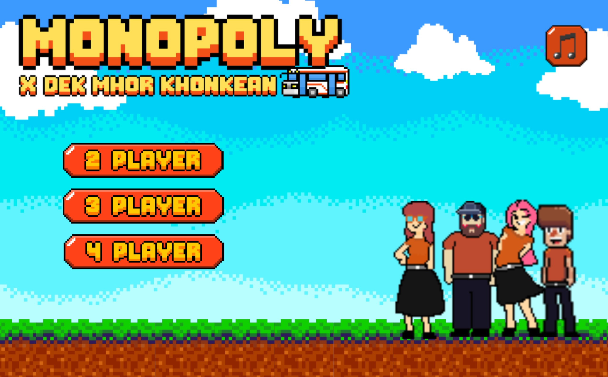

# Monopoly Dek Mor Khor




เกมเศรษฐีเวอร์ชันดิจิทัลที่ดัดแปลงจากเกมกระดานคลาสสิก ออกแบบมาเพื่อความสนุกและการแข่งขันที่น่าตื่นเต้นระหว่างเพื่อนและครอบครัว

## คุณสมบัติเด่น
- ปรับแต่งกติกาการเล่นได้ตามต้องการ
- รองรับผู้เล่นหลายคนสูงสุด 4 คนในหนึ่งจอ
- กระดานเกมที่มีการออกแบบโต้ตอบและน่าสนใจ
- การ์ดพิเศษและเหตุการณ์เฉพาะตัวที่เพิ่มความสนุก


## ข้อกำหนดของระบบ
- **ภาษาโปรแกรม**: Java (แนะนำให้ใช้ JDK 21 ขึ้นไป)
- **ไลบรารีที่จำเป็น**: ดูรายละเอียดใน `pom.xml` หรือเอกสารประกอบโครงการ
- **แพลตฟอร์ม**: รองรับ Windows, macOS และ Linux

## วิธีติดตั้ง
1. คัดลอก repo
   ```bash
   git clone https://github.com/HeHHeyboi/MonopolyDekMorKhor.git
   cd MonopolyDekMorKhor
   ```
2. Download [Maven](https://maven.apache.org/download.cgi) และเพิ่มลง **PATH**
3. Build ด้วย Maven:
   ```bash
   mvn clean install
   ```
4. รันเกม:
   ```bash
   java -jar target/MonopolyDekMorKhor.jar
   ```
หรือ Run ใน Vscode ตรงปุ่มลูกศรและ **Run java**

## วิธีเล่น
1. เลือกจำนวนของผู้เล่น 2-4 คน
3. ทอยลูกเต๋าและวางแผนเพื่อเอาชนะโดยการซื้ออสังหาริมทรัพย์และจัดการทรัพยากร
4. สนุกกับคุณสมบัติและความพิเศษเฉพาะในเวอร์ชันนี้ของเกมเศรษฐี!


## ใบอนุญาต
โครงการนี้ได้รับอนุญาตภายใต้ MIT License ดูรายละเอียดได้ในไฟล์ `LICENSE`

---
สนุกกับการเล่น **Monopoly Dek Mor Khor** และแบ่งปันความสนุกกับเพื่อน ๆ ของคุณ!

